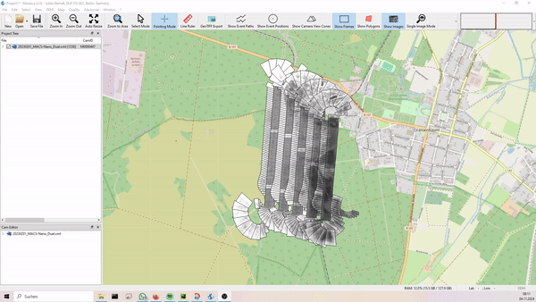
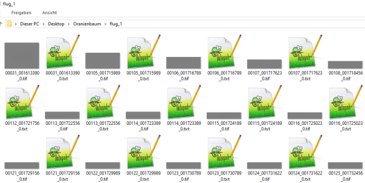
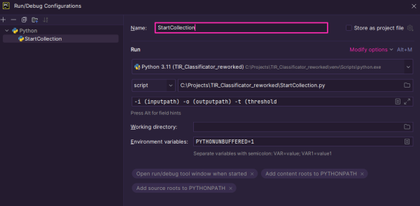

# **TIR_Classificator**

A small tool to analyse TIR-imagery for a given threshold.

## Installation

Download the code from one of these sources:
* https://github.com/Zud0taki/TIR_Classificator_reworked.git
* https://gitlab.dlr.de/os-sec-dev-modules/python/-/tree/main/Tools/TIR_Classificator

Create a virtual environment and install dependencies via:
 > pip install -r requirements.txt

## Usage

To use the tool take a TIR-dataset in MACS-format and open it in MOSAICA.

Set TAC-view instead of full-frame images.

RESET THE HISTOGRAM STRETCH!

Select all images and export as "TIF images (16bit) + coords-files"

To be able to use the tool all files (.tif and .txt) have to be in the same input-folder.

It needs to look something like this:

You can use the tool two ways - either via command-line:
> cd to project-root
>
> .\StartCollection.py -i (inputpath) -o (outputpath) -t (threshold)

or with a configuration, setting the parameters like this:

After running the script, you can use the shape-file from the output-folder and put it into e.g. QGIS to visualize.

